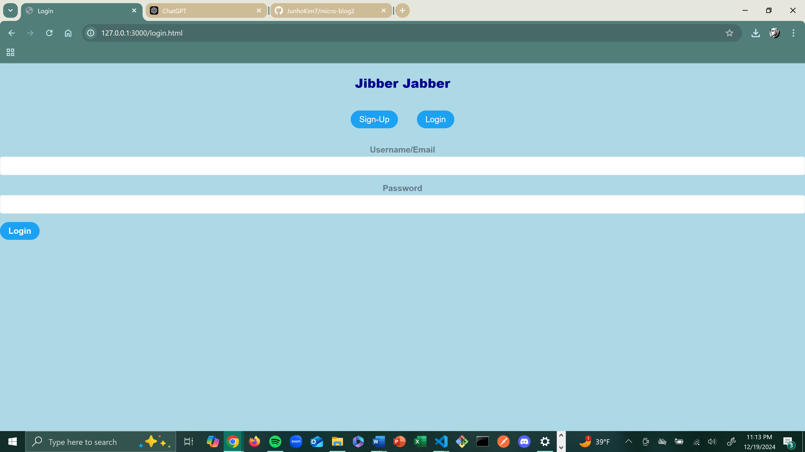
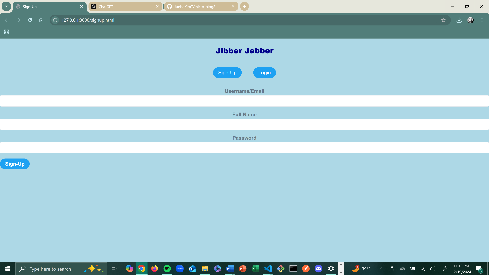
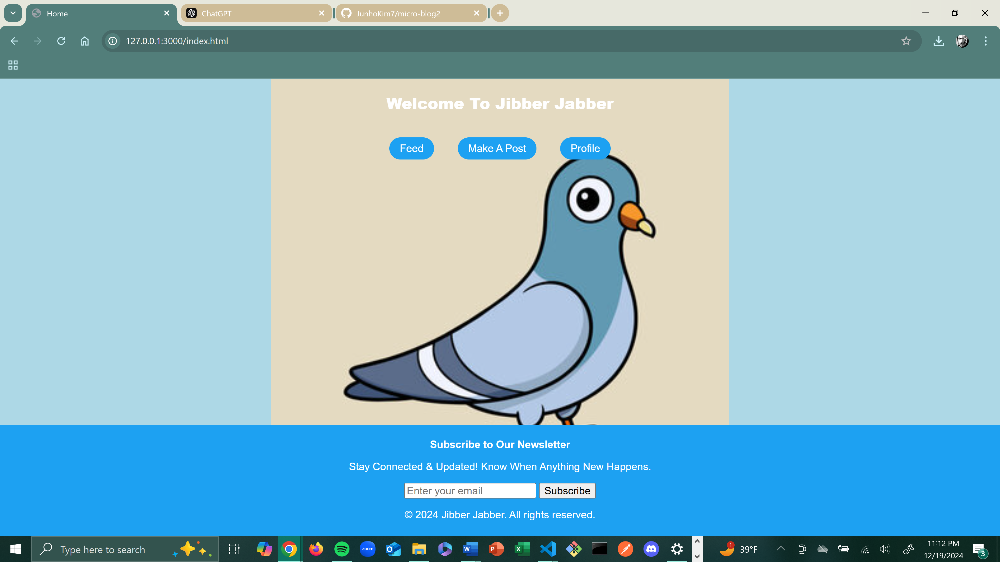
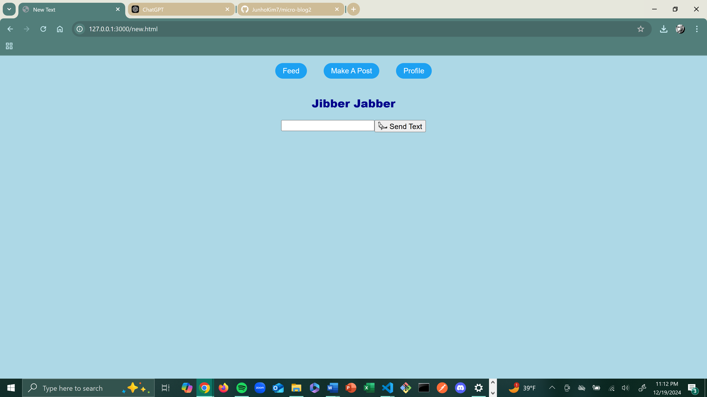
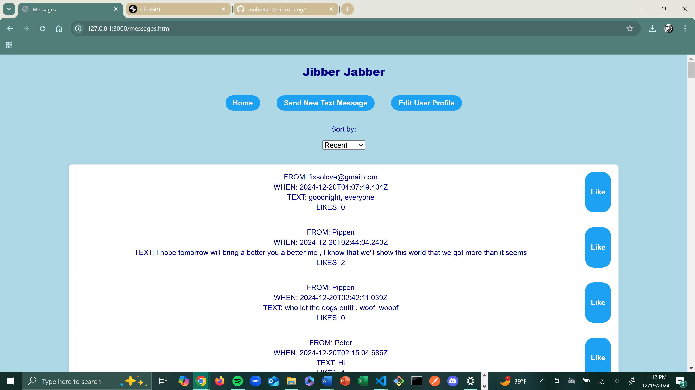
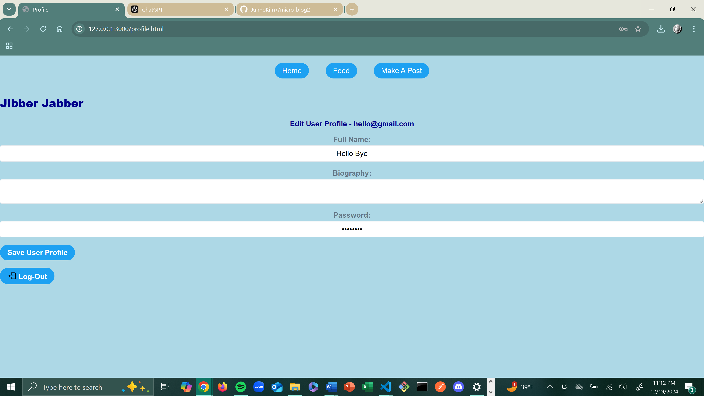

# Jibber Jabber

## Project Overview

**Jibber Jabber** is an online chatroom platform where users can post and share content about their interests, ideas, have conversations, debates, and express the thoughts swimming around their head. The site allows users to create posts, like or dislike content, interact through messages, and manage their profiles. It's a friendly and safe virtual environment for like minded individuals to connect, share, and discover new friends.

## Table of Contents
1. [Features](#features)
2. [Technologies Used](#technologies-used)
3. [Installation](#installation)
4. [Usage](#usage)
5. [File Structure](#file-structure)
6. [Contributing](#contributing)
7. [License](#license)

---

## Features

- **User Authentication**: Users can sign up, log in, and manage their accounts.
- **Create Posts**: Users can create and share posts related to their hobbies.
- **Likes and Dislikes**: Each post can be liked or unliked, allowing users to engage with content.
- **Messaging**: Users can send and receive messages from others.
- **Profile Management**: Users can update their personal details and view their posts.
- **Gravatar Integration**: User avatars are pulled from Gravatar based on the user's email/username.

---

## Technologies Used

- **Frontend**:
  - HTML5, CSS3, JavaScript
  - Bootstrap 4 for responsive design
  - FontAwesome for icons
  - CryptoJS for hashing (used for Gravatar URL generation)
  
- **Backend**:
  - Node.js (with Express.js)
  - JSON Web Tokens (JWT) for user authentication
  - RESTful APIs for fetching data

---

## Installation

To run this project locally, follow the steps below:

1. **Clone the repository**:
    ```bash
    git clone https://github.com/JunhoKim7/micro-blog2.git
    cd 
    ```

2. **Install dependencies**:
    If you're using Node.js for the backend:
    ```bash
    npm install
    ```

3. **Run the application**:
    - For the backend:
      ```bash
      node server.js
      ```
    - For the frontend (open the `index.html` file in a browser).

---

## Usage

Once you have the application running locally, you can interact with it by:

1. **Sign Up / Login**: Create an account using your email and password. After logging in, you'll be redirected to the home page.
   
2. **Create a Post**: You can create a post by navigating to the "Create Post" section, entering your text, and submitting it.

3. **Like and Dislike**: Engage with posts by liking or unliking them.

4. **View Messages**: Check your inbox for messages, and reply to them.

5. **Profile Management**: Update your personal information and view your posts.

---

## File Structure

Here’s an overview of the project structure:

## Screenshots

### Login Page


### Register Page/ SignUp Page


### Home Page


### Post Page


### Messages Page


### Profile Page



## License

This project is licensed under the MIT License - see the [LICENSE.md](LICENSE.md) file for details.

## Author

- **Junho Kim** - [https://github.com/JunhoKim7

## Acknowledgements

- To Kevin Long, my instructor for all the aid and information in fixing and adding to my code.
- **https://www.svgrepo.com/** for the social media icons.


